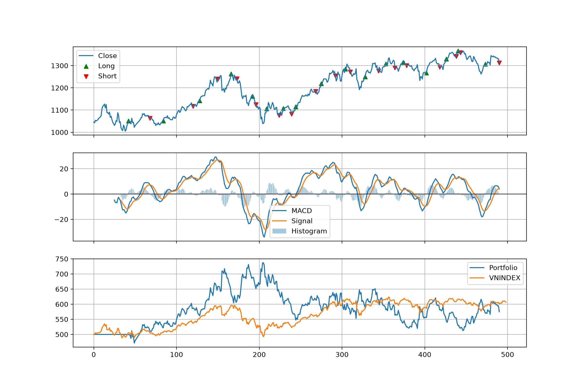
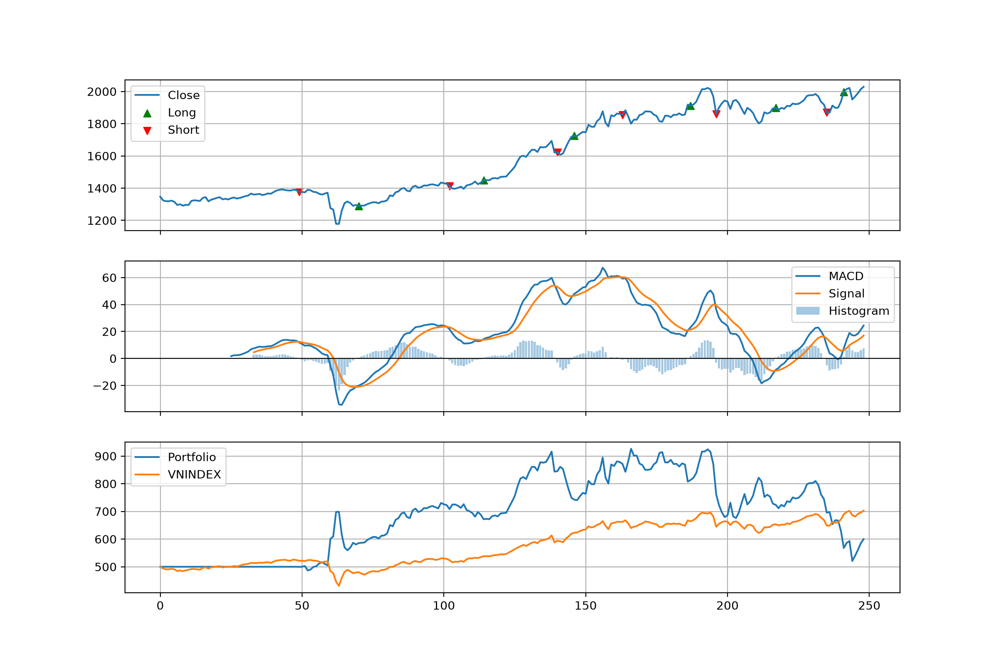

# Keep It Simple, Stupid

totally human written, fuck your agents

## Installation
```sh
python -m venv .venv
.\venv\Scripts\Activate.ps1
pip install uv
uv pip install numpy pandas matplotlib scikit-learn optuna "psycopg[binary,pool]" python-dotenv
```

## Dataloader
```sh
python -m src.dataloader -f 2023-01-01 -t 2024-12-31 -o data/train.csv
python -m src.dataloader -f 2025-01-01 -t 2025-12-31 -o data/test.csv
python -m src.dataloader -f 2023-01-01 -t 2024-12-31 -o data/train_vnindex.csv -vni
python -m src.dataloader -f 2025-01-01 -t 2025-12-31 -o data/test_vnindex.csv -vni
```

## Run backtest
```sh
python -m src.backtest -i config/insample.yaml
python -m src.backtest -i config/outsample.yaml
```

## Results
### Insample backtesting (Run 1782549116)

```log
INFO:__main__:Inital assets: 500000000.000
INFO:__main__:Final assets: 574939585.000
INFO:__main__:Total fee: 28660415.000
INFO:__main__:Sharpe : 0.191
INFO:__main__:Sortino: 0.316
INFO:__main__:MDD    : -30.45%
INFO:__main__:Information Ratio: 0.034
```



### Outsample backtesting (Run 1782549182)

```log
INFO:__main__:Inital assets: 500000000.000
INFO:__main__:Final assets: 599892250.000
INFO:__main__:Total fee: 13707750.000
INFO:__main__:Sharpe : 0.499
INFO:__main__:Sortino: 0.626
INFO:__main__:MDD    : -43.76%
INFO:__main__:Information Ratio: -0.082

```

