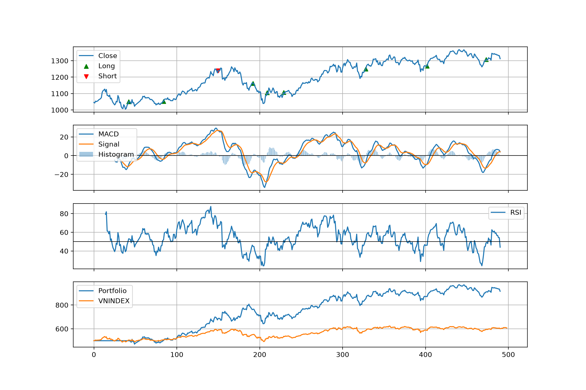
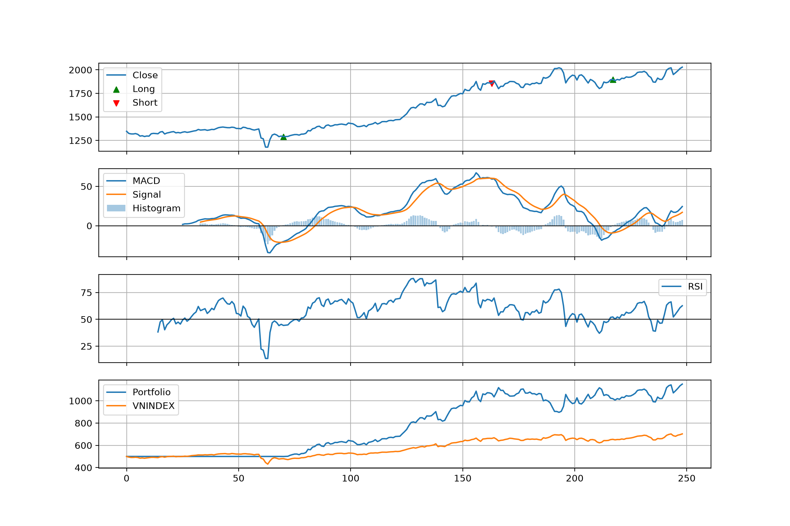

# MACD + RSI Baseline

## Strategy (Momentum)
Hypothesis: MACD and RSI are good enough signals to complement each other for an effective baseline

LONG = `(macd_h.shift(1) < 0) & (macd_h > 0) & (rsi <= config['rsi_oversold'])`

SHORT = `(macd_h.shift(1) > 0) & (macd_h < 0) & (rsi >= config['rsi_overbought'])`


## Installation
```sh
python -m venv .venv
.\venv\Scripts\Activate.ps1
pip install uv
uv pip install numpy pandas matplotlib scikit-learn optuna "psycopg[binary,pool]" python-dotenv
```

## Dataloader
Gathers `datetime, open, close, high, low` from VN30F1M for backtesting and VNINDEX for benchmark. In-sample window goes from `2023-01-01` to `2024-12-31`, out-sample window goes from `2025-01-01` to `2025-12-31`.

```sh
python -m src.dataloader -f 2023-01-01 -t 2024-12-31 -o data/train.csv
python -m src.dataloader -f 2025-01-01 -t 2025-12-31 -o data/test.csv
python -m src.dataloader -f 2023-01-01 -t 2024-12-31 -o data/train_vnindex.csv -vni
python -m src.dataloader -f 2025-01-01 -t 2025-12-31 -o data/test_vnindex.csv -vni
```

## Run backtest
Backtests assumes an initial asset of 500M VND, a buy and sell fee rate of 0.35%, and a risk free rate of 6% for Sharpe and Sortino ratio calculation.

```sh
python -m src.backtest -i config/insample_macd.yaml
python -m src.backtest -i config/outsample_macd.yaml

python -m src.backtest -i config/insample_macd_rsi_30_70.yaml
python -m src.backtest -i config/outsample_macd_rsi_30_70.yaml
```

## Optuna
```sh
python -m src.optuna -i config/insample_macd.yaml

python -m src.backtest -i config/insample_macd_rsi_55_65.yaml
python -m src.backtest -i config/outsample_macd_rsi_55_65.yaml
```

Run ID: [1782557756](logs/1782557756)

```log
Number of finished trials: 441
Top 10 by Sharpe
 1. OS= 55 OB= 65 | Sharpe= 1.1300 Sortino= 1.6367 MDD=-0.2033 IR= 1.0953 Fee=      2.05 Asset=    915.55
 2. OS= 65 OB= 65 | Sharpe= 1.1300 Sortino= 1.6367 MDD=-0.2033 IR= 1.0953 Fee=      2.05 Asset=    915.55
 3. OS= 60 OB= 65 | Sharpe= 1.1300 Sortino= 1.6367 MDD=-0.2033 IR= 1.0953 Fee=      2.05 Asset=    915.55
 4. OS= 70 OB=100 | Sharpe= 0.6855 Sortino= 0.8672 MDD=-0.3137 IR= 0.8679 Fee=      0.37 Asset=    761.23
 5. OS= 95 OB= 90 | Sharpe= 0.6855 Sortino= 0.8672 MDD=-0.3137 IR= 0.8679 Fee=      0.37 Asset=    761.23
 6. OS= 55 OB= 95 | Sharpe= 0.6855 Sortino= 0.8672 MDD=-0.3137 IR= 0.8679 Fee=      0.37 Asset=    761.23
 7. OS= 85 OB= 85 | Sharpe= 0.6855 Sortino= 0.8672 MDD=-0.3137 IR= 0.8679 Fee=      0.37 Asset=    761.23
 8. OS= 75 OB= 85 | Sharpe= 0.6855 Sortino= 0.8672 MDD=-0.3137 IR= 0.8679 Fee=      0.37 Asset=    761.23
 9. OS= 65 OB=100 | Sharpe= 0.6855 Sortino= 0.8672 MDD=-0.3137 IR= 0.8679 Fee=      0.37 Asset=    761.23
10. OS= 75 OB= 75 | Sharpe= 0.6855 Sortino= 0.8672 MDD=-0.3137 IR= 0.8679 Fee=      0.37 Asset=    761.23
```

The oversold and overbought thresholds are selected as 55 and 65 after running the Optuna study.


## Results
### Insample backtesting
Method | Run ID
--- | ---
MACD | [1782557837](logs/1782557837)
MACD + RSI (30/70) | [1782557844](logs/1782557844)
MACD + RSI (55/65) | [1782557850](logs/1782557850)

Metrics | MACD | MACD + RSI (30/70) | MACD + RSI (55/65)
--- | --- | --- | ---
Sharpe Ratio | 0.191 | NA | 1.130
Sortino Ratio | 0.316 | NA | 1.637
Maximum Drawdown | -30.45% | 0% | -20.33%
Information Ratio | 0.034 | -0.697 | 1.095

Insample charts for MACD + RSI:


### Outsample backtesting
Method | Run ID
--- | ---
MACD | [1782557841](logs/1782557841)
MACD + RSI (30/70) | [1782557847](logs/1782557847)
MACD + RSI (55/65) | [1782557854](logs/1782557854)

Metrics | MACD | MACD + RSI (30/70) | MACD + RSI (55/65)
--- | --- | --- | ---
Sharpe Ratio | 0.499 | NA | 2.441
Sortino Ratio | 0.626 | NA | 3.529
Maximum Drawdown | -43.76% | 0% | -19.85%
Information Ratio | -0.082 | -1.741 | 1.389

Outsample charts for MACD + RSI:
